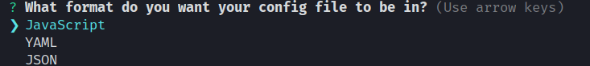

# JS Configurations

Hey, this is my js configs for projects

## First Step

Let's install ESLint in our project

```bash
yarn add eslint -D
```

and now lets start the eslint =)

```bash
yarn eslint --init
```

## Second Step

Here we gonna choose ur choices for config the project, this is MY settings, **copy for ur own risk =)**


if ~~for gods sake pls no~~ u are using the old javascript features, u can use the option **CommomJS**

Choose the framework of ur preference here ~~remember angular is bad and for this he is not here~~ _just a joke_


Choose the platform here **use space for mark/unmark the option**


I use this option for use the AirBNB style guide


this option is w/e, made ur favorite, i like JS <3


**PRESS YES MA BOY**


## Third Step

#### Install ESlint Plugin and Prettier Plugin


## Fourth Step

This options is for enable eslint for this languages


## Fifth Step

Now we are gonna overwrite some settings in our .eslintrc.js

```bash
  rules: {
    //pluggin prettier for error
    "prettier/prettier" : "error",

    //for not use this in class
    "class-methods-use-this": "off",

    //modified params in sequelize
    "no-param-reassign": "off",

    //write variables in camelCase or not
    camelcase: "off",

    //enable unused vars
    "no-unused-vars": ["error", { argsIgnorePattern: "next" }]
  }
```

And now lets add prettier dependecies

```bash
yarn add prettier eslint-config-prettier -D
yarn add prettier eslint-plugin-prettier -D
```

## Sixth Step

Lets make a file called ".prettierrc"

put this settings there

```bash
{
  "singleQuote": true,
  "trailingComma": "es5"
}

```

Its Over boys, THX =)
